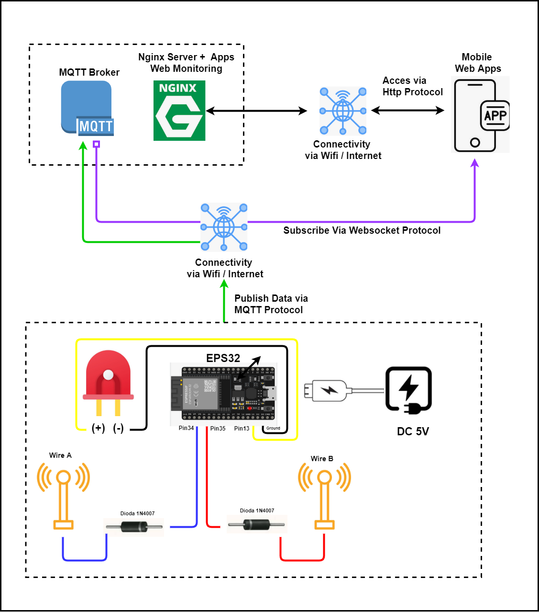
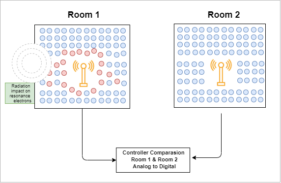
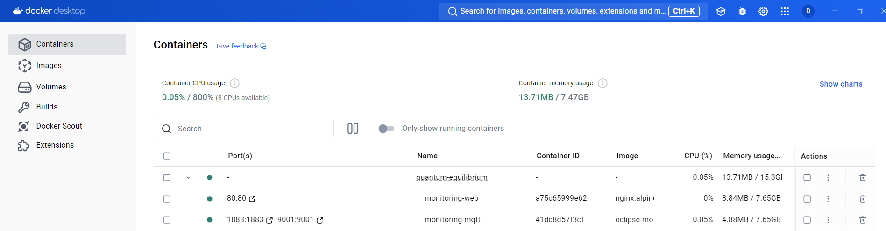
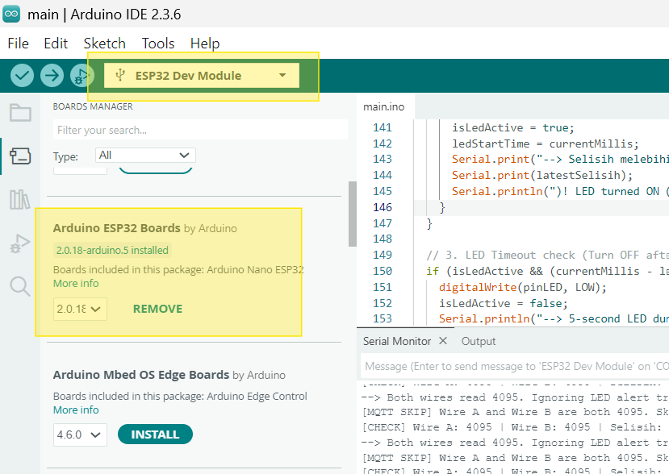
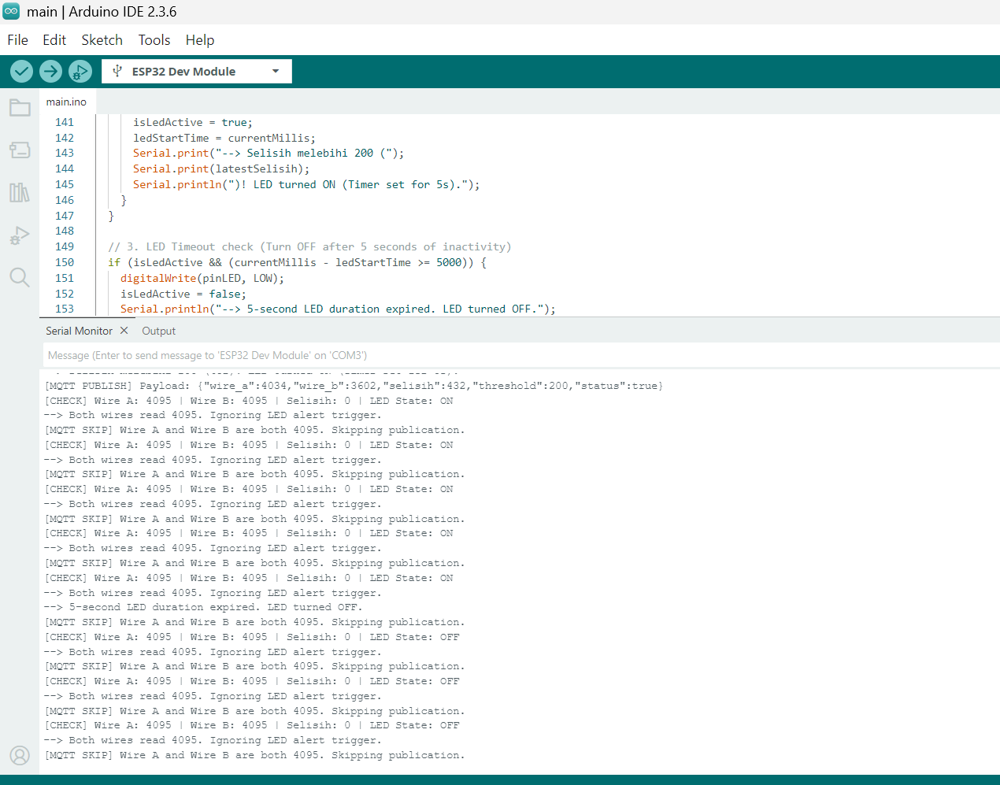
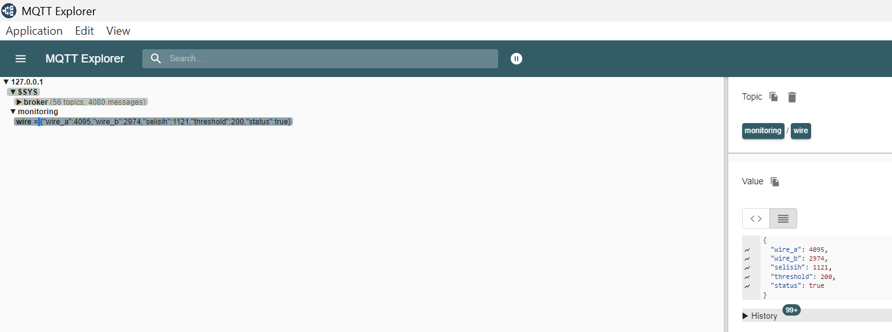
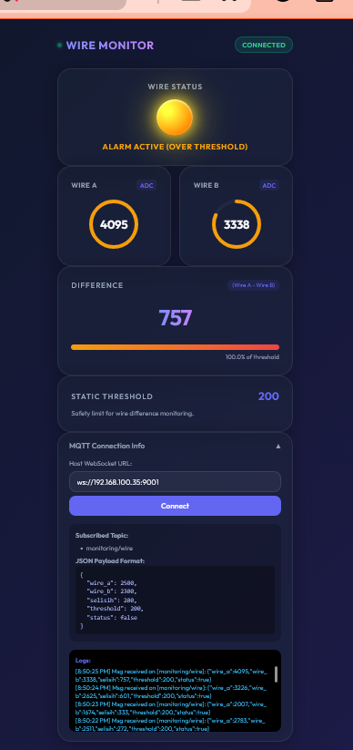
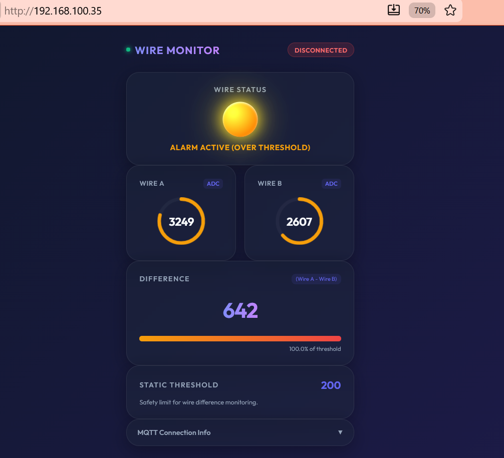
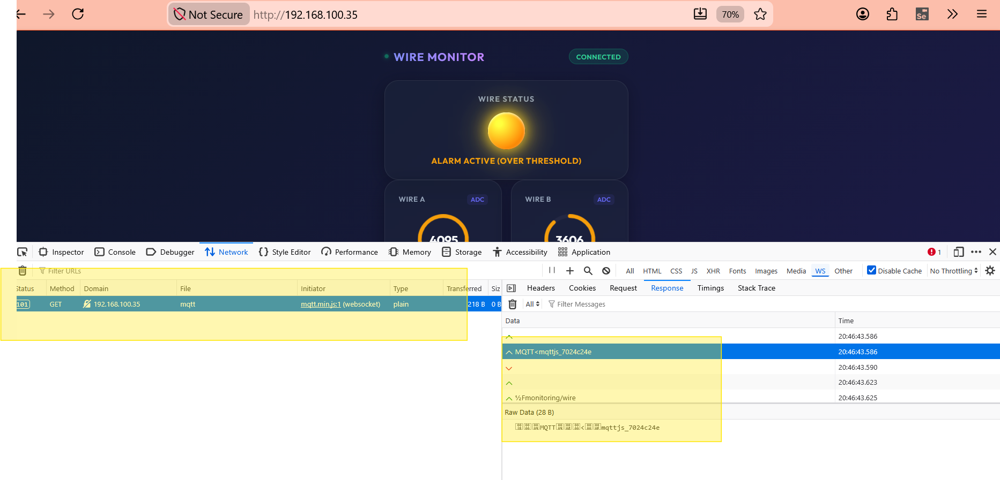
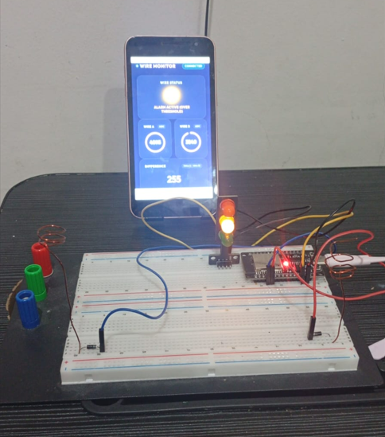

# ⚡ Quantum Equilibrium 

> **Discover the unseen. Measure the imbalance. Detect the invisible.**

Welcome to **Quantum Equilibrium**, an advanced wireless monitoring system that leverages **radiation differentials and electron resonance behavior** to detect invisible objects, energy disturbances, and signal anomalies in real time. By analyzing the difference between two wire sensors (Wire A and Wire B), this system can reveal hidden fluctuations in electromagnetic fields — opening the door to a new dimension of environmental awareness.


## 📑 Table of Contents

- [⚡ Quantum Equilibrium](#-quantum-equilibrium)
  - [📑 Table of Contents](#-table-of-contents)
  - [1. What Is Quantum Equilibrium?](#1-what-is-quantum-equilibrium)
  - [2. The Science: Radiation \& Electron Resonance](#2-the-science-radiation--electron-resonance)
    - [2.1 Radiation Differential](#21-radiation-differential)
    - [2.2 Electron Resonance](#22-electron-resonance)
    - [2.3 Practical Applications](#23-practical-applications)
  - [3. System Architecture](#3-system-architecture)
    - [3.1 Architecture Diagram](#31-architecture-diagram)
    - [3.2 How It Works](#32-how-it-works)
  - [4. Illustration: Concept Visualization](#4-illustration-concept-visualization)
  - [5. Screenshots \& Explanations](#5-screenshots--explanations)
    - [5.1 Docker Compose Deployment](#51-docker-compose-deployment)
    - [5.2 ESP32 Module Setup](#52-esp32-module-setup)
    - [5.3 Arduino Monitor Output](#53-arduino-monitor-output)
    - [5.4 MQTT Broker — Publish from ESP32](#54-mqtt-broker--publish-from-esp32)
    - [5.5 Mobile Dashboard — Wire Difference Monitoring](#55-mobile-dashboard--wire-difference-monitoring)
    - [5.6 MQTT WebSocket Subscription](#56-mqtt-websocket-subscription)
    - [5.7 Hardware Prototype](#57-hardware-prototype)
    - [5.8 Demo Video](#58-demo-video)
  - [6. Technology Stack](#6-technology-stack)
  - [7. Getting Started](#7-getting-started)
  - [8. License](#8-license)


## 1. What Is Quantum Equilibrium?

**Quantum Equilibrium** is a full-stack IoT monitoring system that tracks the **difference (selisih)** between two analog input channels from an ESP32 microcontroller. It streams this data over MQTT to a real-time web dashboard, where users can monitor wire status, set threshold alarms, and visualize the differential behavior of electromagnetic signals.

The system is designed for applications in:
- **Non-visible object detection** — sensing disturbances in electromagnetic fields caused by objects that are not optically visible.
- **Energy anomaly detection** — identifying fluctuations in ambient radiation or energy fields.
- **Signal jamming detection** — recognizing interference patterns that disrupt normal signal propagation.


## 2. The Science: Radiation & Electron Resonance

### 2.1 Radiation Differential

Every object emits and reflects electromagnetic radiation at different frequencies. When two sensors (Wire A and Wire B) are placed in the same environment, any object or energy field that disturbs the local electromagnetic balance will cause a **difference (selisih)** between the two sensor readings. By monitoring this difference, the system can detect:

- **Invisible objects** — materials that absorb or reflect radiation unevenly create a measurable differential.
- **Energy disturbances** — sources of electromagnetic noise (motors, power lines, wireless devices) alter the ambient field.
- **Signal jamming** — intentional interference creates chaotic fluctuations in the differential reading.

### 2.2 Electron Resonance

Electrons in conductive materials resonate at specific frequencies when exposed to electromagnetic fields. The ESP32's analog-to-digital converters (ADC) capture these resonance variations as raw numeric values. When the electron resonance between two wires changes asymmetrically, the difference value reveals the presence of external influences that would otherwise go unnoticed.

### 2.3 Practical Applications

| Application | How It Works |
|||
| **Object Detection** | A non-visible object blocks or reflects ambient radiation, causing one wire to read differently than the other. |
| **Energy Monitoring** | Sudden spikes or drops in the differential indicate power surges, equipment failure, or environmental changes. |
| **Interference Detection** | Erratic, high-frequency changes in the difference signal suggest signal jamming or electromagnetic interference. |


## 3. System Architecture

### 3.1 Architecture Diagram



The architecture diagram above illustrates the complete data flow:

| Component | Role |
|||
| **ESP32 Microcontroller** | Reads analog signals from Wire A and Wire B, computes the difference (selisih), and publishes JSON data via MQTT. |
| **Mosquitto MQTT Broker** | Receives sensor data from ESP32 over TCP (port 1883) and exposes a WebSocket interface (port 9001). |
| **Nginx Web Server** | Serves the web frontend and proxies WebSocket connections to the MQTT broker at `/mqtt`. |
| **Web Frontend (Dashboard)** | A mobile-first PWA that subscribes to the `monitoring/wire` topic and visualizes real-time data with gauges, progress bars, and alarm indicators. |

### 3.2 How It Works

1. The ESP32 reads analog values from two sensor pins (Wire A, Wire B).
2. It calculates the difference: `selisih = |Wire A - Wire B|`.
3. The device publishes a JSON payload to the MQTT broker:

```json
{
  "wire_a": 2500,
  "wire_b": 2300,
  "selisih": 200,
  "threshold": 200,
  "status": false
}
```

4. The Mosquitto broker receives the data and forwards it to all subscribers.
5. The web dashboard displays the values in real time using circular gauges, a difference progress bar, and a warning lamp that activates when `selisih > threshold`.


## 4. Illustration: Concept Visualization



This illustration visualizes the core concept of **radiation differential detection**:

- **Radiation sources** emit electromagnetic waves that permeate the environment.
- **Wire A and Wire B** act as passive antennas, each picking up slightly different radiation levels based on their position and orientation.
- When an **invisible object** (shown as a translucent shape) enters the field, it distorts the radiation pattern, causing the two wires to read differently.
- The **difference (selisih)** value therefore acts as a proxy for detecting the presence, position, or movement of objects and energy sources that cannot be seen with the naked eye.


## 5. Screenshots & Explanations

### 5.1 Docker Compose Deployment



This screenshot shows the Docker Compose deployment process. The system runs two containers:

- **mosquitto** — The Eclipse Mosquitto MQTT message broker with ports 1883 (MQTT) and 9001 (WebSocket).
- **nginx** — Nginx web server that hosts the frontend and acts as a reverse proxy for MQTT WebSocket connections.

The containers are orchestrated using `docker-compose.yml`, making deployment simple and repeatable across environments.


### 5.2 ESP32 Module Setup



This screenshot shows the ESP32 microcontroller connected to the development environment. The ESP32 is programmed using the Arduino IDE with:

- Two analog input pins configured for Wire A and Wire B.
- WiFi connectivity to connect to the local network.
- MQTT client library to publish sensor data to the broker.
- A configurable threshold value that determines when the alarm status is triggered.


### 5.3 Arduino Monitor Output



The Arduino Serial Monitor displays the raw sensor readings:

```
Wire A: 2450
Wire B: 1890
Selisih: 560
Threshold: 200
Status: ALARM!
```

This output confirms that the ESP32 is correctly reading the analog values, computing the difference, and evaluating the threshold condition. The serial output is useful for debugging and calibration.


### 5.4 MQTT Broker — Publish from ESP32



This screenshot shows the MQTT broker receiving data published by the ESP32. The Mosquitto broker logs confirm successful message reception on the `monitoring/wire` topic. Each message contains the JSON payload with `wire_a`, `wire_b`, `selisih`, `threshold`, and `status` fields.

This stage validates that the end-to-end data pipeline from sensor to broker is working correctly.


### 5.5 Mobile Dashboard — Wire Difference Monitoring




These screenshots show the web dashboard displayed on a mobile device. The user interface includes:

- **WIRE STATUS** indicator — a warning lamp that glows yellow when the difference exceeds the threshold, with the label "ALARM ACTIVE (OVER THRESHOLD)" or "SYSTEM NORMAL".
- **WIRE A** and **WIRE B** cards — each displays a circular gauge and the current ADC reading.
- **DIFFERENCE** card — shows the computed `selisih` value in large gradient text, along with a progress bar showing the percentage relative to the threshold.
- **STATIC THRESHOLD** card — displays the configured threshold limit.
- **MQTT Connection Info** panel — collapsible section with WebSocket URL configuration, subscribed topics, JSON payload format reference, and a live log.

The dashboard is designed as a **Progressive Web App (PWA)** with a glass-morphism aesthetic, making it suitable for mobile monitoring in the field.


### 5.6 MQTT WebSocket Subscription



This screenshot shows the MQTT broker handling WebSocket subscriptions from the web frontend. The Nginx server proxies WebSocket connections from the browser to the Mosquitto broker at the `/mqtt` endpoint. The log confirms that the frontend has successfully subscribed to the `monitoring/wire` topic and is receiving real-time updates.


### 5.7 Hardware Prototype



This photo shows the physical hardware prototype of the Quantum Equilibrium system:

- **ESP32 development board** as the central processing unit.
- **Two wire sensors** connected to analog input pins, acting as passive antennas for radiation detection.
- **Breadboard** for circuit prototyping.
- **Power supply** via USB connection to a computer or power bank.

The prototype demonstrates the minimal hardware required to implement the radiation differential detection concept.


### 5.8 Demo Video

🎥 **Watch the system in action:** [Quantum Equilibrium — Wire Difference Monitoring Demo](https://www.youtube.com/shorts/lXxBOP9GZvs)

[](https://www.youtube.com/shorts/lXxBOP9GZvs)

This short video demonstrates the complete system working in real time — from the ESP32 reading analog values from Wire A and Wire B, publishing the data via MQTT, to the web dashboard displaying the difference (selisih) value with the alarm lamp activating when the threshold is exceeded.


## 6. Technology Stack

| Layer | Technology |
|||
| **Microcontroller** | ESP32 (Arduino Framework) |
| **Messaging** | MQTT via Eclipse Mosquitto |
| **Web Server** | Nginx (reverse proxy + static files) |
| **Frontend** | HTML, CSS, JavaScript (PWA) |
| **Real-time Data** | MQTT over WebSocket (mqtt.js) |
| **Containerization** | Docker & Docker Compose |
| **Visualization** | SVG gauges, animated progress bars, glass-morphism UI |


## 7. Getting Started

1. **Clone the repository:**
   ```bash
   git clone https://github.com/dendie851/quantum-equilibrium.git
   cd quantum-equilibrium
   ```

2. **Start the services:**
   ```bash
   docker-compose up -d
   ```

3. **Flash the ESP32:**
   Open the firmware in `microcontroller/main/` with Arduino IDE, configure your WiFi credentials and MQTT broker address, then upload to the ESP32.

4. **Access the dashboard:**
   Open a browser and navigate to `http://localhost` (or your server's IP address).

5. **Monitor:**
   Watch the real-time data flow from the ESP32 sensors to the web dashboard.


## 8. License

This project is open source and available under the MIT License.


<p align="center">
  Made with ⚡ for the invisible world around us.
</p>